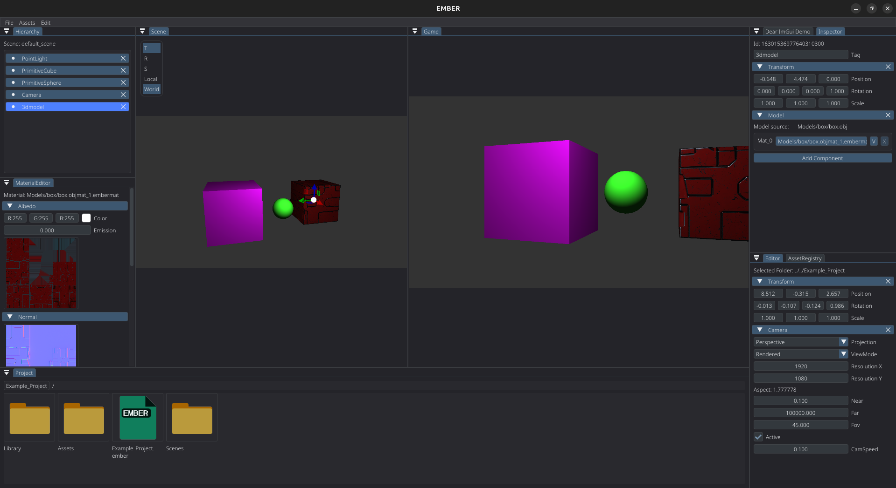
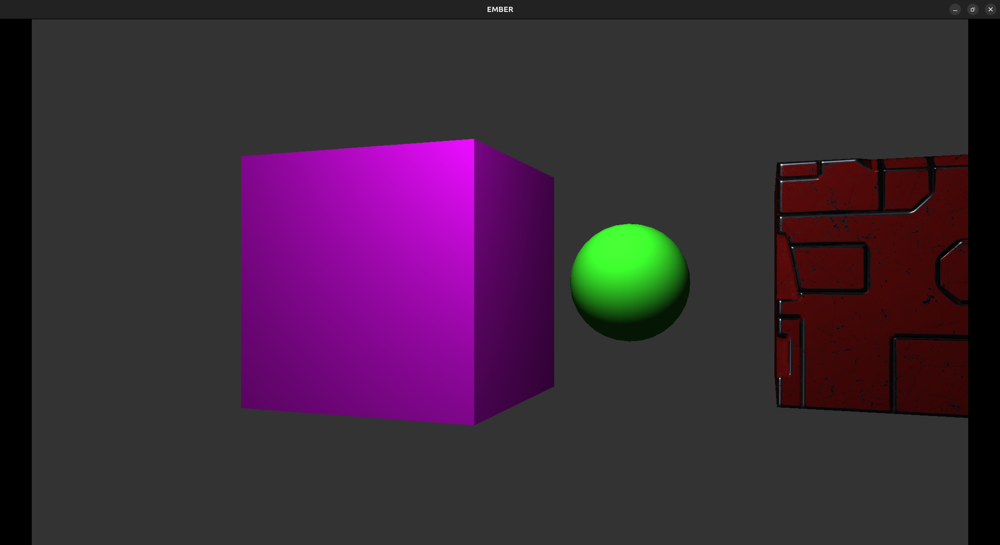

# Ember Engine

**Ember** is a modular C++ game engine designed with a clear separation between the **engine core**, **editor**, and **runtime**.  

---

## Features

- C++ core engine
- Entity Component System (ECS)
- Asset management system
- Editor application
- Standalone runtime
- Modular CMake-based architecture
- Example project included

---

## Architecture

### Ember (Core)
The core engine module shared by both the editor and runtime.  
It contains:
- ECS implementation
- Asset loading and management
- Core systems and utilities
- Engine-level abstractions
- Project management

---

### EmberEditor
A standalone editor application built on top of the engine core.  
Responsible for:
- Scene editing
- Asset management
- Project configuration
- Development tooling

Editor-only code is isolated from the runtime.

---

### EmberRuntime
A lightweight executable used to:
- Load projects
- Run scenes
- Execute gameplay logic

This ensures clean separation between development tools and shipped builds.

---

### Example Project
A minimal project showcasing:
- Asset directory layout
- Scene structure
- `.ember` project configuration file

---

## Building

### Requirements
- C++17 or newer
- CMake 3.10+
- Clang, GCC, or MSVC

### Cloning
```bash
git clone --recurse-submodules https://github.com/tilensketa/Ember.git
```

### Build
```bash
./build.sh
```

## Running
Launch Editor
```bash
./runEditor.sh
```

Run Runtime
```bash
./runRuntime.sh
```

## Roadmap
- Phyisics
- Scripting support
- Rendering improvements
- Asset hot-reloading
- Serialization and packaging pipeline

Editor

Runtime


## Acknowledgements

This project was built with learning, inspiration, and architectural guidance from  
**The Cherno** and his game engine development series.

Ember is an original implementation and does not contain source code from the tutorials,
but many design decisions were influenced by the concepts presented.
